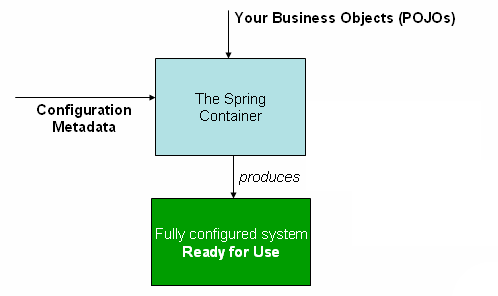

# Core Technologies

## 1. The IoC Container

### 1.1. Introduction to the Spring IoC Container and Beans
Inversion of Control (IoC) - IoC is also known as dependency injection (DI). 
It is a process whereby objects define their dependencies (that is, the other objects they work with) 
only through constructor arguments, arguments to a factory method, or properties that are set on 
the object instance after it is constructed or returned from a factory method.
The container then injects those dependencies when it creates the bean.
This process is fundamentally the inverse (hence the name, Inversion of Control) 
of the bean itself controlling the instantiation or location of its dependencies 
by using direct construction of classes or a mechanism such as the Service Locator pattern.

The `org.springframework.beans` and `org.springframework.context` packages are the basis for Spring Framework’s IoC container.
`BeanFactory` provides the configuration framework and basic functionality, 
and the `ApplicationContext` adds more enterprise-specific functionality. 
The ApplicationContext is a complete superset of the BeanFactory and is used exclusively in this chapter in descriptions of Spring’s IoC container.

### 1.2. Container Overview
The `org.springframework.context.ApplicationContext` interface represents the Spring IoC container and is responsible for instantiating, configuring, and assembling the beans.
The configuration metadata is represented in XML, Java annotations, or Java code. 
It lets you express the objects that compose your application and the rich interdependencies between those objects.

The following diagram shows a high-level view of how Spring works.
Your application classes are combined with configuration metadata so that, after the ApplicationContext is created and initialized

#### 1.2.1. Configuration Metadata
Configuration metadata is traditionally supplied in a simple and intuitive XML format.

XML-based configuration metadata configures these beans as `<bean/>` elements inside a top-level `<beans/>` element. 
Java configuration typically uses `@Bean`-annotated methods within a `@Configuration` class.

The following example shows the basic structure of XML-based configuration metadata:

    <?xml version="1.0" encoding="UTF-8"?>
    <beans xmlns="http://www.springframework.org/schema/beans"
    xmlns:xsi="http://www.w3.org/2001/XMLSchema-instance"
    xsi:schemaLocation="http://www.springframework.org/schema/beans
    https://www.springframework.org/schema/beans/spring-beans.xsd">
    
        <bean id="..." class="...">  
            <!-- collaborators and configuration for this bean go here -->
        </bean>
    
        <bean id="..." class="...">
            <!-- collaborators and configuration for this bean go here -->
        </bean>
    
        <!-- more bean definitions go here -->
    
    </beans>

Composing XML-based Configuration Metadata

    <beans>
    <import resource="services.xml"/>
    <import resource="resources/messageSource.xml"/>
    <import resource="/resources/themeSource.xml"/>
    
        <bean id="bean1" class="..."/>
        <bean id="bean2" class="..."/>
    </beans>

###### 1.2.3 Using the Container

Instantiating a Container

`ApplicationContext context = new ClassPathXmlApplicationContext("services.xml", "daos.xml");`

The ApplicationContext lets you read bean definitions and access them, as the following example shows:

    // create and configure beans
    ApplicationContext context = new ClassPathXmlApplicationContext("services.xml", "daos.xml");
    
    // retrieve configured instance
    PetStoreService service = context.getBean("petStore", PetStoreService.class);
    
    // use configured instance
    List<String> userList = service.getUsernameList();

The most flexible variant is GenericApplicationContext in combination with reader delegates — for example, with XmlBeanDefinitionReader for XML files, as the following example shows:

    GenericApplicationContext context = new GenericApplicationContext();
    new XmlBeanDefinitionReader(context).loadBeanDefinitions("services.xml", "daos.xml");
    context.refresh();

### 1.3. Bean Overview
Bean definitions are represented as BeanDefinition objects, which contain (among other information) the following metadata:
* A package-qualified class name: typically, the actual implementation class of the bean being defined.
* Bean behavioral configuration elements, which state how the bean should behave in the container (scope, lifecycle callbacks, and so forth).
* References to other beans that are needed for the bean to do its work. These references are also called collaborators or dependencies.
* Other configuration settings to set in the newly created object — for example, the size limit of the pool or the number of connections to use in a bean that manages a connection pool.

This metadata translates to a set of properties that make up each bean definition. The following table describes these properties:
* Class
* Name
* Scope
* Constructor arguments
* Properties
* Autowiring mode
* Lazy initialization mode
* Initialization method
* Destruction method

#### 1.3.1 Naming Beans
Every bean has one or more identifiers. These identifiers must be unique within the container that hosts the bean. A bean usually has only one identifier.
In XML-based configuration metadata, you use the `id` attribute (alphanumeric) and the `name` attribute.
you can also specify them in the `name` attribute, separated by a comma (,), semicolon (;), or white space.
Motivations for not supplying a name are related to using inner beans and autowiring collaborators.

###### Aliasing a Bean outside the Bean Definition
It is sometimes desirable to introduce an alias for a bean that is defined elsewhere. This is commonly the case in large systems where configuration is split amongst each subsystem.

    <alias name="fromName" alias="toName"/>

#### 1.3.2 Instantiating Beans

A bean definition is essentially a recipe for creating one or more objects. The container looks at the recipe for a named bean when asked and uses the configuration metadata encapsulated by that bean definition to create (or acquire) an actual object.

You can use the Class property in one of two ways:
* to specify the bean class to be constructed
* to specify the actual class containing the static factory method that is invoked to create the object

Static nested class, they can be separated by a dollar sign ($) or a dot (.) `com.example.SomeThing$OtherThing`.

#### Instantiation with a Static Factory Method
Specify the class that contains the static factory method and an attribute named factory-method to specify the name of the factory method itself.

    <bean id="clientService"
    class="examples.ClientService"
    factory-method="createInstance"/>

#### Instantiation by Using an Instance Factory Method
To use this mechanism, leave the class attribute empty and, in the factory-bean attribute, specify the name of a bean in the current (or parent or ancestor) container.

    <!-- the factory bean, which contains a method called createInstance() -->
    <bean id="serviceLocator" class="examples.DefaultServiceLocator">
        <!-- inject any dependencies required by this locator bean -->
    </bean>
    
    <!-- the bean to be created via the factory bean -->
    <bean id="clientService"
    factory-bean="serviceLocator"
    factory-method="createClientServiceInstance"/>

#### Determining a Bean’s Runtime Type
The recommended way to find out about the actual runtime type of a particular bean is a BeanFactory.getType call for the specified bean name. This takes all of the above cases into account and returns the type of object that a BeanFactory.getBean call is going to return for the same bean name.

## 1.4 Dependencies
### 1.4.1. Dependency Injection
Dependency injection (DI) is a process whereby objects define their dependencies only through constructor arguments, arguments to a factory method, or properties that are set on the object instance after it is constructed or returned from a factory method.
The container then injects those dependencies when it creates the bean. 

#### Constructor Argument Resolution
Assuming that the ThingTwo and ThingThree classes are not related by inheritance, no potential ambiguity exists.

    <beans>
        <bean id="beanOne" class="x.y.ThingOne">
            <constructor-arg ref="beanTwo"/>
            <constructor-arg ref="beanThree"/>
        </bean>
    
        <bean id="beanTwo" class="x.y.ThingTwo"/>
    
        <bean id="beanThree" class="x.y.ThingThree"/>
    </beans>

Constructor argument type matching

    <bean id="exampleBean" class="examples.ExampleBean">
        <constructor-arg type="int" value="7500000"/>
        <constructor-arg type="java.lang.String" value="42"/>
    </bean>

Constructor argument index

    <bean id="exampleBean" class="examples.ExampleBean">
        <constructor-arg index="0" value="7500000"/>
        <constructor-arg index="1" value="42"/>
    </bean>

Constructor argument name

    <bean id="exampleBean" class="examples.ExampleBean">
        <constructor-arg name="years" value="7500000"/>
        <constructor-arg name="ultimateAnswer" value="42"/>
    </bean>
_

    package examples;
    
    public class ExampleBean {
    
        // Fields omitted
    
        @ConstructorProperties({"years", "ultimateAnswer"})
        public ExampleBean(int years, String ultimateAnswer) {
            this.years = years;
            this.ultimateAnswer = ultimateAnswer;
        }
    }

#### Setter-based Dependency Injection
Good rule of thumb to use constructors for mandatory dependencies and setter methods or configuration methods for optional dependencies.

The following example shows a class that can only be dependency-injected by using pure setter injection

Dependency Resolution Process
* The ApplicationContext is created and initialized with configuration metadata that describes all the beans
* Dependencies are provided to the bean, when the bean is actually created.
* Each property or constructor argument is an actual definition of the value to set, or a reference to another bean in the container.
* Each property or constructor argument that is a value is converted from its specified format to the actual type of that property or constructor argument. By default, Spring can convert a value supplied in string format to all built-in types, such as int, long, String, boolean, and so forth.

If you configure beans for classes A and B to be injected into each other, the Spring IoC container detects this circular reference at runtime, and throws a BeanCurrentlyInCreationException.

### 1.4.2. Dependencies and Configuration in Detail
Straight Values (Primitives, Strings, and so on)

    <bean id="myDataSource" class="org.apache.commons.dbcp.BasicDataSource" destroy-method="close">
        <!-- results in a setDriverClassName(String) call -->
        <property name="driverClassName" value="com.mysql.jdbc.Driver"/>
        <property name="url" value="jdbc:mysql://localhost:3306/mydb"/>
        <property name="username" value="root"/>
        <property name="password" value="misterkaoli"/>
    </bean>
.

    <beans xmlns="http://www.springframework.org/schema/beans"
    xmlns:xsi="http://www.w3.org/2001/XMLSchema-instance"
    xmlns:p="http://www.springframework.org/schema/p"
    xsi:schemaLocation="http://www.springframework.org/schema/beans
    https://www.springframework.org/schema/beans/spring-beans.xsd">
    
        <bean id="myDataSource" class="org.apache.commons.dbcp.BasicDataSource"
            destroy-method="close"
            p:driverClassName="com.mysql.jdbc.Driver"
            p:url="jdbc:mysql://localhost:3306/mydb"
            p:username="root"
            p:password="misterkaoli"/>
    
    </beans>
#### The idref element
The idref element is simply an error-proof way to pass the id (a string value - not a reference) 

    <bean id="theTargetBean" class="..."/>
    
    <bean id="theClientBean" class="...">
        <property name="targetName">
            <idref bean="theTargetBean"/>
        </property>
    </bean>

.

    <bean id="theTargetBean" class="..." />
    
    <bean id="client" class="...">
        <property name="targetName" value="theTargetBean"/>
    </bean>

#### References to Other Beans (Collaborators)
The `ref` element is the final element inside a <constructor-arg/> or <property/>

    <!-- in the parent context -->
    <bean id="accountService" class="com.something.SimpleAccountService">
        <!-- insert dependencies as required as here -->
    </bean>
    
    <!-- in the child (descendant) context -->
    <bean id="accountService" <!-- bean name is the same as the parent bean -->
        class="org.springframework.aop.framework.ProxyFactoryBean">
        <property name="target">
        <ref parent="accountService"/> <!-- notice how we refer to the parent bean -->
        </property>
        <!-- insert other configuration and dependencies as required here -->
    </bean>

#### Inner Beans
A <bean/> element inside the <property/> or <constructor-arg/> elements defines an inner bean

    <bean id="outer" class="...">
        <!-- instead of using a reference to a target bean, simply define the target bean inline -->
        <property name="target">
            <bean class="com.example.Person"> <!-- this is the inner bean -->
                <property name="name" value="Fiona Apple"/>
                <property name="age" value="25"/>
            </bean>
        </property>
    </bean>

#### Collections
The <list/>, <set/>, <map/>, and <props/> elements

    <bean id="moreComplexObject" class="example.ComplexObject">
        <!-- results in a setAdminEmails(java.util.Properties) call -->
        <property name="adminEmails">
            <props>
                <prop key="administrator">administrator@example.org</prop>
                <prop key="support">support@example.org</prop>
                <prop key="development">development@example.org</prop>
            </props>
        </property>
        <!-- results in a setSomeList(java.util.List) call -->
        <property name="someList">
            <list>
                <value>a list element followed by a reference</value>
                <ref bean="myDataSource" />
            </list>
        </property>
        <!-- results in a setSomeMap(java.util.Map) call -->
        <property name="someMap">
            <map>
                <entry key="an entry" value="just some string"/>
                <entry key ="a ref" value-ref="myDataSource"/>
            </map>
        </property>
        <!-- results in a setSomeSet(java.util.Set) call -->
        <property name="someSet">
            <set>
                <value>just some string</value>
                <ref bean="myDataSource" />
            </set>
        </property>
    </bean>

The value of a map key or value, or a set value, can also be any of the following elements:
`bean | ref | idref | list | set | map | props | value | null
`

#### Collection Merging
The child Properties collection’s value set inherits all property elements from the parent <props/>, and the child’s value for the support value overrides the value in the parent collection.
    
    <beans>
        <bean id="parent" abstract="true" class="example.ComplexObject">
            <property name="adminEmails">
                <props>
                    <prop key="administrator">administrator@example.com</prop>
                    <prop key="support">support@example.com</prop>
                </props>
            </property>
        </bean>
        <bean id="child" parent="parent">
            <property name="adminEmails">
                <!-- the merge is specified on the child collection definition -->
                <props merge="true">
                    <prop key="sales">sales@example.com</prop>
                    <prop key="support">support@example.co.uk</prop>
                </props>
            </property>
        </bean>
    <beans>

#### Null and Empty String Values

    <bean class="ExampleBean">
        <property name="email" value=""/>
    </bean>
.

    <bean class="ExampleBean">
        <property name="email">
            <null/>
        </property>
    </bean>

#### XML Shortcut with the p-namespace

    <beans xmlns="http://www.springframework.org/schema/beans"
    xmlns:xsi="http://www.w3.org/2001/XMLSchema-instance"
    xmlns:p="http://www.springframework.org/schema/p"
    xsi:schemaLocation="http://www.springframework.org/schema/beans
    https://www.springframework.org/schema/beans/spring-beans.xsd">
    
        <bean name="john-classic" class="com.example.Person">
            <property name="name" value="John Doe"/>
            <property name="spouse" ref="jane"/>
        </bean>
    
        <bean name="john-modern"
            class="com.example.Person"
            p:name="John Doe"
            p:spouse-ref="jane"/>
    
        <bean name="jane" class="com.example.Person">
            <property name="name" value="Jane Doe"/>
        </bean>
    </beans>

#### XML Shortcut with the c-namespace
Allows inlined attributes for configuring the constructor arguments rather then nested constructor-arg elements.

    <beans xmlns="http://www.springframework.org/schema/beans"
    xmlns:xsi="http://www.w3.org/2001/XMLSchema-instance"
    xmlns:c="http://www.springframework.org/schema/c"
    xsi:schemaLocation="http://www.springframework.org/schema/beans
    https://www.springframework.org/schema/beans/spring-beans.xsd">
    
        <bean id="beanTwo" class="x.y.ThingTwo"/>
        <bean id="beanThree" class="x.y.ThingThree"/>
    
        <!-- traditional declaration with optional argument names -->
        <bean id="beanOne" class="x.y.ThingOne">
            <constructor-arg name="thingTwo" ref="beanTwo"/>
            <constructor-arg name="thingThree" ref="beanThree"/>
            <constructor-arg name="email" value="something@somewhere.com"/>
        </bean>
    
        <!-- c-namespace declaration with argument names -->
        <bean id="beanOne" class="x.y.ThingOne" c:thingTwo-ref="beanTwo"
            c:thingThree-ref="beanThree" c:email="something@somewhere.com"/>
    
    </beans>

You can use fallback to the argument indexes, as follows:

    <!-- c-namespace index declaration -->
    <bean id="beanOne" class="x.y.ThingOne" c:_0-ref="beanTwo" c:_1-ref="beanThree"
    c:_2="something@somewhere.com"/>

#### Compound Property Names
The something bean has a fred property, which has a bob property, which has a sammy property, and that final sammy property is being set to a value of 123

    <bean id="something" class="things.ThingOne">
        <property name="fred.bob.sammy" value="123" />
    </bean>

### 1.4.3. Using depends-on
The depends-on attribute can explicitly force one or more beans to be initialized before the bean using this element is initialized.

    <bean id="beanOne" class="ExampleBean" depends-on="manager,accountDao">
        <property name="manager" ref="manager" />
    </bean>
    
    <bean id="manager" class="ManagerBean" />
    <bean id="accountDao" class="x.y.jdbc.JdbcAccountDao" />

### 1.4.4. Lazy-initialized Beans
All singleton beans as part of the initialization process. Generally, this pre-instantiation is desirable, because errors in the configuration or surrounding environment are discovered immediately.
A lazy-initialized bean tells the IoC container to create a bean instance when it is first requested.

    <bean id="lazy" class="com.something.ExpensiveToCreateBean" lazy-init="true"/>
    <bean name="not.lazy" class="com.something.AnotherBean"/>

However, when a lazy-initialized bean is a dependency of a singleton bean that is not lazy-initialized, the ApplicationContext creates the lazy-initialized bean at startup, because it must satisfy the singleton’s dependencies.

You can also control lazy-initialization at the container level 

    <beans default-lazy-init="true">
        <!-- no beans will be pre-instantiated... -->
    </beans>

### 1.4.5. Autowiring Collaborators
You can let Spring resolve collaborators (other beans) automatically for your bean by inspecting the contents of the ApplicationContext.
* Autowiring can significantly reduce the need to specify properties or constructor arguments
* Autowiring can update a configuration as your objects evolve 
  
You can specify the autowire mode for a bean definition with the autowire attribute of the <bean/> element.

Autowiring modes:
* no - (Default) No autowiring.
* byName - Spring looks for a bean with the same name as the property that needs to be autowired. Bean definition is set to autowire by name and it contains a master property (that is, it has a setMaster(..) method), Spring looks for a bean definition named master and uses it to set the property.
* byType - Lets a property be autowired if exactly one bean of the property type exists in the container. If more than one exists, a fatal exception is thrown, which indicates that you may not use byType autowiring for that bean. If there are no matching beans, nothing happens (the property is not set).
* constructor - Analogous to byType but applies to constructor arguments. If there is not exactly one bean of the constructor argument type in the container, a fatal error is raised.

Limitations and Disadvantages of Autowiring:
* Explicit dependencies in property and constructor-arg settings always override autowiring. You cannot autowire simple properties such as primitives, Strings, and Classes (and arrays of such simple properties).
* Autowiring is less exact than explicit wiring.
* Wiring information may not be available to tools that may generate documentation from a Spring container.
* Multiple bean definitions within the container may match the type specified by the setter method or constructor argument to be autowired

Excluding a Bean from Autowiring
n Spring’s XML format, set the `autowire-candidate` attribute of the `<bean/>` element to `false`. 

### 1.4.6. Method Injection
When a singleton bean needs to collaborate with another bean, problem arises when the bean lifecycles are different.
A solution is to forego some inversion of control. You can make bean A aware of the container by implementing the ApplicationContextAware interface, and by making a getBean("B") call to the container ask for (a typically new) bean B instance every time bean A needs it.

    public class CommandManager implements ApplicationContextAware {
    
        private ApplicationContext applicationContext;
    
        public Object process(Map commandState) {
            // grab a new instance of the appropriate Command
            Command command = createCommand();
            // set the state on the (hopefully brand new) Command instance
            command.setState(commandState);
            return command.execute();
        }
    
        protected Command createCommand() {
            // notice the Spring API dependency!
            return this.applicationContext.getBean("command", Command.class);
        }
    
        public void setApplicationContext(
                ApplicationContext applicationContext) throws BeansException {
            this.applicationContext = applicationContext;
        }
    }

Lookup Method Injection

Lookup method injection is the ability of the container to override methods on container-managed beans and return the lookup result for another named bean in the container.

    public abstract class CommandManager {
    
        public Object process(Object commandState) {
            // grab a new instance of the appropriate Command interface
            Command command = createCommand();
            // set the state on the (hopefully brand new) Command instance
            command.setState(commandState);
            return command.execute();
        }
    
        // okay... but where is the implementation of this method?
        protected abstract Command createCommand();
    }
.

    <!-- a stateful bean deployed as a prototype (non-singleton) -->
    <bean id="myCommand" class="fiona.apple.AsyncCommand" scope="prototype">
        <!-- inject dependencies here as required -->
    </bean>
    
    <!-- commandProcessor uses statefulCommandHelper -->
    <bean id="commandManager" class="fiona.apple.CommandManager">
        <lookup-method name="createCommand" bean="myCommand"/>
    </bean>

Alternatively, within the annotation-based component model, you can declare a lookup method through the @Lookup annotation.

    public abstract class CommandManager {
    
        public Object process(Object commandState) {
            Command command = createCommand();
            command.setState(commandState);
            return command.execute();
        }
    
        @Lookup("myCommand")
        protected abstract Command createCommand();
    }

Arbitrary Method Replacement

With XML-based configuration metadata, you can use the replaced-method element to replace an existing method implementation with another, for a deployed bean. 

    <bean id="myValueCalculator" class="x.y.z.MyValueCalculator">
        <!-- arbitrary method replacement -->
        <replaced-method name="computeValue" replacer="replacementComputeValue">
            <arg-type>String</arg-type>
        </replaced-method>
    </bean>
    
    <bean id="replacementComputeValue" class="a.b.c.ReplacementComputeValue"/>

## 1.5 Bean scopes

* singleton
* prototype - Scopes a single bean definition to any number of object instances.
* request - Scopes a single bean definition to the lifecycle of a single HTTP request.
* session - Scopes a single bean definition to the lifecycle of an HTTP Session.
* application - Scopes a single bean definition to the lifecycle of a ServletContext.
* websocket - Scopes a single bean definition to the lifecycle of a WebSocket.

### 1.5.4. Request, Session, Application, and WebSocket Scopes
The request, session, application, and websocket scopes are available only if you use a web-aware Spring ApplicationContext implementation (such as XmlWebApplicationContext). If you use these scopes with regular Spring IoC containers, such as the ClassPathXmlApplicationContext, an IllegalStateException that complains about an unknown bean scope is thrown.

##### Initial Web Configuration

To support the scoping of beans at the request, session, application, and websocket levels (web-scoped beans), some minor initial configuration is required before you define your beans.

If you access scoped beans within Spring Web MVC, in effect, within a request that is processed by the Spring DispatcherServlet, no special setup is necessary.

For Servlet 3.0+, this can be done programmatically by using the WebApplicationInitializer interface.

DispatcherServlet, RequestContextListener, and RequestContextFilter all do exactly the same thing, namely bind the HTTP request object to the Thread that is servicing that request. 

##### Application Scope
This is somewhat similar to a Spring singleton bean but differs in two important ways: It is a singleton per ServletContext, not per Spring 'ApplicationContext' (for which there may be several in any given web application), and it is actually exposed and therefore visible as a ServletContext attribute.

##### Scoped Beans as Dependencies
If you want to inject (for example) an HTTP request-scoped bean into another bean of a longer-lived scope, you may choose to inject an AOP proxy in place of the scoped bean.

    <?xml version="1.0" encoding="UTF-8"?>
    <beans xmlns="http://www.springframework.org/schema/beans"
    xmlns:xsi="http://www.w3.org/2001/XMLSchema-instance"
    xmlns:aop="http://www.springframework.org/schema/aop"
    xsi:schemaLocation="http://www.springframework.org/schema/beans
    https://www.springframework.org/schema/beans/spring-beans.xsd
    http://www.springframework.org/schema/aop
    https://www.springframework.org/schema/aop/spring-aop.xsd">
    
        <!-- an HTTP Session-scoped bean exposed as a proxy -->
        <bean id="userPreferences" class="com.something.UserPreferences" scope="session">
            <!-- instructs the container to proxy the surrounding bean -->
            <aop:scoped-proxy/> 
        </bean>
    
        <!-- a singleton-scoped bean injected with a proxy to the above bean -->
        <bean id="userService" class="com.something.SimpleUserService">
            <!-- a reference to the proxied userPreferences bean -->
            <property name="userPreferences" ref="userPreferences"/>
        </bean>
    </beans>

### 1.5.5. Custom Scopes
The bean scoping mechanism is extensible. You can define your own scopes or even redefine existing scopes, although the latter is considered bad practice and you cannot override the built-in singleton and prototype scopes.

The Scope interface has four methods to get objects from the scope, remove them from the scope, and let them be destroyed.

After you write and test one or more custom Scope implementations, you need to make the Spring container aware of your new scopes.
This method is declared on the ConfigurableBeanFactory interface, which is available through the BeanFactory property on most of the concrete ApplicationContext implementations that ship with Spring.

    Scope threadScope = new SimpleThreadScope();
    beanFactory.registerScope("thread", threadScope);
.

    <?xml version="1.0" encoding="UTF-8"?>
    <beans xmlns="http://www.springframework.org/schema/beans"
    xmlns:xsi="http://www.w3.org/2001/XMLSchema-instance"
    xmlns:aop="http://www.springframework.org/schema/aop"
    xsi:schemaLocation="http://www.springframework.org/schema/beans
    https://www.springframework.org/schema/beans/spring-beans.xsd
    http://www.springframework.org/schema/aop
    https://www.springframework.org/schema/aop/spring-aop.xsd">
    
        <bean class="org.springframework.beans.factory.config.CustomScopeConfigurer">
            <property name="scopes">
                <map>
                    <entry key="thread">
                        <bean class="org.springframework.context.support.SimpleThreadScope"/>
                    </entry>
                </map>
            </property>
        </bean>
    
        <bean id="thing2" class="x.y.Thing2" scope="thread">
            <property name="name" value="Rick"/>
            <aop:scoped-proxy/>
        </bean>
    
        <bean id="thing1" class="x.y.Thing1">
            <property name="thing2" ref="thing2"/>
        </bean>
    
    </beans>

## 1.6. Customizing the Nature of a Bean
### 1.6.1. Lifecycle Callbacks
To interact with the container’s management of the bean lifecycle, you can implement the Spring InitializingBean and DisposableBean interfaces.

##### Initialization Callbacks
The org.springframework.beans.factory.InitializingBean interface lets a bean perform initialization work after the container has set all necessary properties on the bean

    <bean id="exampleInitBean" class="examples.ExampleBean" init-method="init"/>
.

    public class ExampleBean {
    
        public void init() {
            // do some initialization work
        }
    }

or

    <bean id="exampleInitBean" class="examples.AnotherExampleBean"/>
.

    public class AnotherExampleBean implements InitializingBean {
    
        @Override
        public void afterPropertiesSet() {
            // do some initialization work
        }
    }

##### Destruction Callbacks

    void destroy() throws Exception;    
.

    <bean id="exampleInitBean" class="examples.ExampleBean" destroy-method="cleanup"/>

or

    <bean id="exampleInitBean" class="examples.AnotherExampleBean"/>
.

    public class AnotherExampleBean implements DisposableBean {
    
        @Override
        public void destroy() {
            // do some destruction work (like releasing pooled connections)
        }
    }

##### Default Initialization and Destroy Methods
    <beans default-init-method="init">
    
        <bean id="blogService" class="com.something.DefaultBlogService">
            <property name="blogDao" ref="blogDao" />
        </bean>
    
    </beans>

##### Combining Lifecycle Mechanisms
You have three options for controlling bean lifecycle behavior:
* The InitializingBean and DisposableBean callback interfaces
* Custom init() and destroy() methods
* The @PostConstruct and @PreDestroy annotations. You can combine these mechanisms to control a given bean.

Multiple lifecycle mechanisms configured for the same bean, with different initialization methods, are called as follows:
* Methods annotated with @PostConstruct
* afterPropertiesSet() as defined by the InitializingBean callback interface
* A custom configured init() method

Destroy methods are called in the same order:
* Methods annotated with @PreDestroy
* destroy() as defined by the DisposableBean callback interface
* A custom configured destroy() method

##### Startup and Shutdown Callbacks
Any Spring-managed object may implement the Lifecycle interface. Then, when the ApplicationContext itself receives start and stop signals (for example, for a stop/restart scenario at runtime), it cascades those calls to all Lifecycle implementations defined within that context. 

You may only know that objects of a certain type should start prior to objects of another type. In those cases, the SmartLifecycle interface defines another option, namely the getPhase() method as defined on its super-interface, Phased.
SmartLifecycle and whose getPhase() method returns Integer.MIN_VALUE would be among the first to start and the last to stop.

##### Shutting Down the Spring IoC Container Gracefully in Non-Web Applications
To register a shutdown hook, call the registerShutdownHook() method that is declared on the ConfigurableApplicationContext interface.

### 1.6.2. ApplicationContextAware and BeanNameAware
Object instance that implements the org.springframework.context.ApplicationContextAware interface, the instance is provided with a reference to that ApplicationContext can programmatically manipulate the ApplicationContext.

### 1.6.3. Other Aware Interfaces
Spring offers a wide range of Aware callback interfaces that let beans indicate to the container that they require a certain infrastructure dependency
* ApplicationContextAware
* ApplicationEventPublisherAware
* BeanClassLoaderAware
* BeanFactoryAware
* BeanNameAware
* LoadTimeWeaverAware
* MessageSourceAware
* NotificationPublisherAware
* ResourceLoaderAware
* ServletConfigAware
* ServletContextAware

